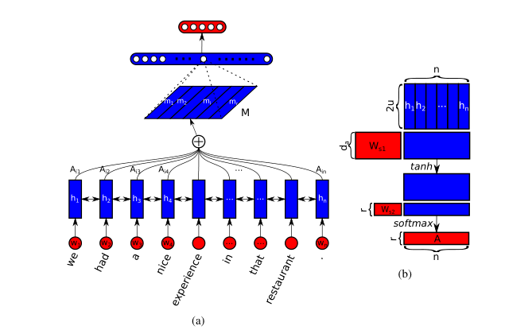

# Self_Attention_Pytorch

This repository is a **Pytorch** implementation of Self-Attention ([arxiv](https://dl.acm.org/doi/10.5555/1522515.1522524)):

> A STRUCTURED SELF - ATTENTIVE SENTENCE EMBEDDING



### Files in the folder

- `yelp_dataset/`:
  - `data/`:
    - test.csv
    - train.csv
  - `data_process/`:
    - xxx.pkl    ——temp data
  - Yelp-reviews-8211-Full迅雷磁力链接.torrent
- `code/`: implementations of Self-Attention
- `visualization/`:
  - heatmap.html
  - myplot.png
- `glove.6B/`:
  - pre-train embedding if you need

### Required packages

The code has been tested running under Python 3.6, with the following packages installed (along with their dependencies):

- numpy == 1.14.5
- scipy == 1.5.4
- pytorch == 1.7.0
- spacy == 2.3.5
- keras == 2.3.1
- pandas == 1.1.4 

### Running the code

```
$ cd code
$ python main.py
change the exegesis when you need
```